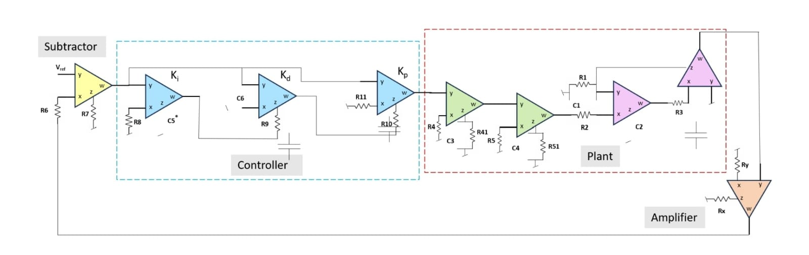

# PID Controller for L-DOPA Model Using AD844 CFOA

## 📌 Project Overview

This project implements a **closed-loop PID control system for an L-DOPA pharmacokinetic model** using **AD844 Current Feedback Operational Amplifiers (CFOAs)** in PSpice.

The main objective is to simulate how a PID controller can regulate the system output by continuously comparing the desired reference value with the feedback signal.

The complete system consists of:

**Reference → Subtractor → PID Controller → Plant → Amplifier → Feedback**

The circuit is simulated using **PSpice**.

---

## 🎯 Objectives

- Design a closed-loop PID control system.
- Implement proportional, integral and derivative actions using AD844 CFOAs.
- Model the L-DOPA system using RC networks and CFOA-based circuits.
- Apply negative feedback to reduce the error between reference and output.
- Analyze the transient response of the complete system using PSpice.

---

## 🧩 Block Diagram



The system can be understood in five main sections:

1. **Subtractor**
2. **PID Controller**
3. **Plant**
4. **Output Amplifier**
5. **Feedback Path**

---

# 🔹 1. Subtractor

The subtractor calculates the error signal:

\[
e(t) = V_{ref}(t) - V_{feedback}(t)
\]

The reference input is compared with the feedback signal from the output.

This error signal is then given to the PID controller.

In the circuit, the subtractor is implemented using an **AD844 CFOA** with resistors R6 and R7.

---

# 🔹 2. PID Controller

The PID controller consists of three parallel actions:

- Proportional (P)
- Integral (I)
- Derivative (D)

The general PID equation is:

\[
u(t) = K_p e(t) + K_i\int e(t)dt + K_d\frac{de(t)}{dt}
\]

where:

- \(K_p\) = proportional gain
- \(K_i\) = integral gain
- \(K_d\) = derivative gain
- \(e(t)\) = error signal
- \(u(t)\) = controller output

### Proportional Section

The proportional section produces an output proportional to the instantaneous error.

It is implemented using an AD844 CFOA and associated resistors.

### Integral Section

The integral section accumulates the error over time.

It is implemented using:

- AD844 CFOA
- R8
- C5
- Multiplier-capacitor arrangement

The integral action helps reduce steady-state error.

### Derivative Section

The derivative section responds to the rate of change of the error.

It is implemented using:

- AD844 CFOA
- R9
- C6

The derivative action helps anticipate changes in the error signal and can improve transient response.

---

# 🔹 3. Plant Model

The plant represents the simplified dynamic behavior of the L-DOPA system.

The plant is implemented using **RC networks and AD844 CFOAs**.

It contains:

- First-order low-pass section
- Second low-pass section
- Second-order section

The RC networks provide the required dynamic behavior and time constants.

The plant parameters are represented using resistor and capacitor values in the PSpice circuit.

---

# 🔹 4. Amplifier

An additional amplifier stage is used at the output of the plant.

The amplifier is implemented using an **AD844 CFOA** with:

- \(R_x = 1.56\,k\Omega\)
- \(R_y = 1\,k\Omega\)

This stage provides the required scaling of the plant output before the signal is fed back to the subtractor.

---

# 🔹 5. Feedback

The output signal is fed back to the subtractor.

The subtractor compares:

\[
V_{ref} - V_{feedback}
\]

This creates a **closed-loop control system**.

If the output differs from the reference, an error is generated and the PID controller acts to reduce this error.

---

# ⚙️ Circuit Implementation

The complete circuit is implemented using **AD844 CFOA blocks**.

### Main AD844 blocks

| Block | Function |
|------|----------|
| X1 | Subtractor |
| X2 | Integrator |
| X3 | Differentiator |
| X4 | Proportional Controller |
| X5 | First Low-Pass Filter |
| X6 | Second Low-Pass Filter |
| X7, X8 | Second-order plant section |
| XA | Output Amplifier |
| XC1, XC2 | Multiplier / capacitor-related section |

---

# 🔧 Important Components

### Controller

| Component | Value |
|----------|-------|
| R8 | 2.5 kΩ |
| R9 | 20 kΩ |
| R10 | 3 kΩ |
| R11 | 32.5 kΩ |
| C5 | 10 µF |
| C6 | 2.2 µF |

### Plant

| Component | Value |
|----------|-------|
| R4 | 8.507 kΩ |
| R41 | 57 kΩ |
| C3 | 940 nF |
| R5 | 178.38 kΩ |
| R51 | 660 kΩ |
| C4 | 940 nF |
| R1 | 241.718 kΩ |
| C1 | 940 nF |
| R2 | 309 kΩ |
| C2 | 940 nF |
| R3 | 309 kΩ |

### Output Amplifier

| Component | Value |
|----------|-------|
| Rx | 1.56 kΩ |
| Ry | 1 kΩ |

---

# 💻 Simulation

The circuit is simulated in **PSpice** using an AD844 SPICE model.

The circuit uses:

```spice
.lib ad844.lib
